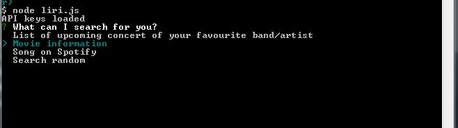
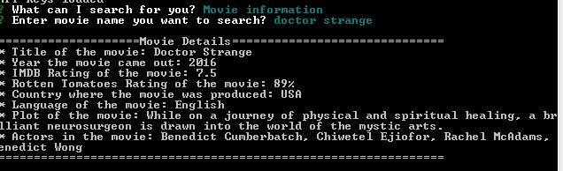
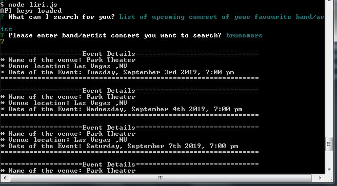
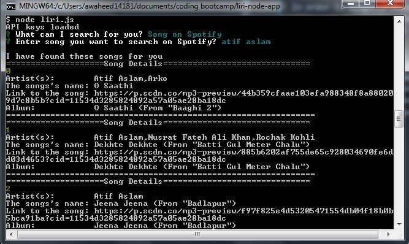
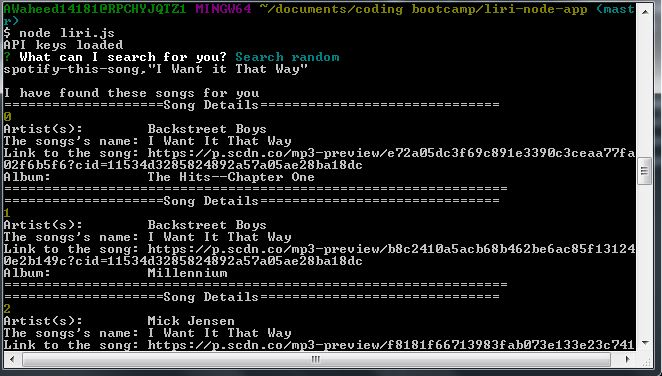
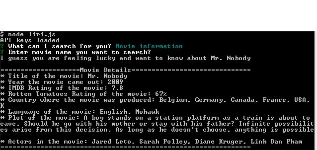
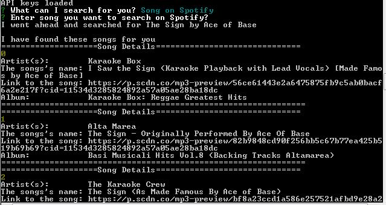

# LIRI Bot

Welcome to the LIRI bot. LIRI can help you with
1. Search songs on Spotify
2. Get movie plot, ratings etc
3. Search events/concert of your favorite band
4. Depending on LIRI's mood, it randomly searches for a song/movie/concert

In order to slightly enhace user experience, rather then allow user to simply enter command followed by a search string, LIRI uses tiered input to gather responses. That means when the user first runs node liri.js, LIRI presents a list of question. This slightly enhances user experience, for someone who is not aware what to ask LIRI. Depending on what the user selects the next questions is customized based on answer to the previous response. Below are the LIRI Output

**Note**: provide your own .env files for following keys 

```
SPOTIFY_ID=your spotify ID
SPOTIFY_SECRET=your spotify secret

#OMDB API key
omdb_key=OMDB key

#OMDB Bands in Town API key
bands_key=key
```

List of starting prompts



LIRI response to a movie search



LIRI response to a band in town



LIRI response to a song search on spotify



LIRI response when random is selected



LIRI response when user does not enter a name of the movie



LIRI response when user does not enter the name of the song



## API Utilized
OMDB, Spotify, BandsinTown 

## NPM Packages
* Moment
* Spotify 
* Axios
* Inquirer
